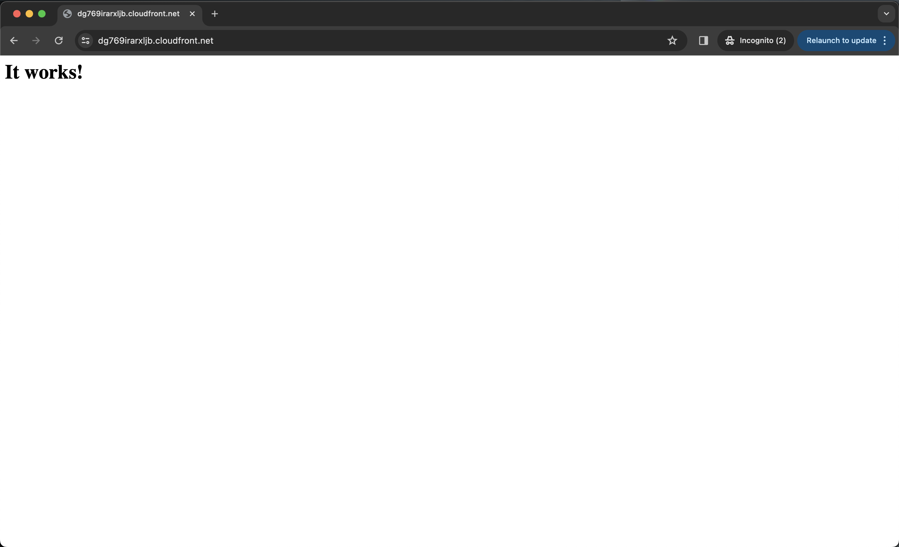
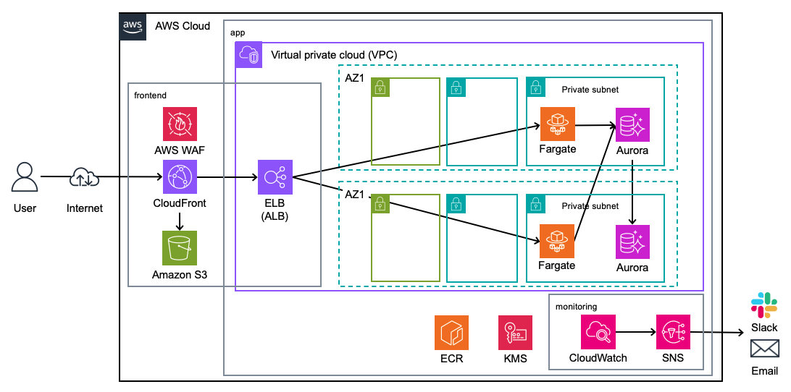
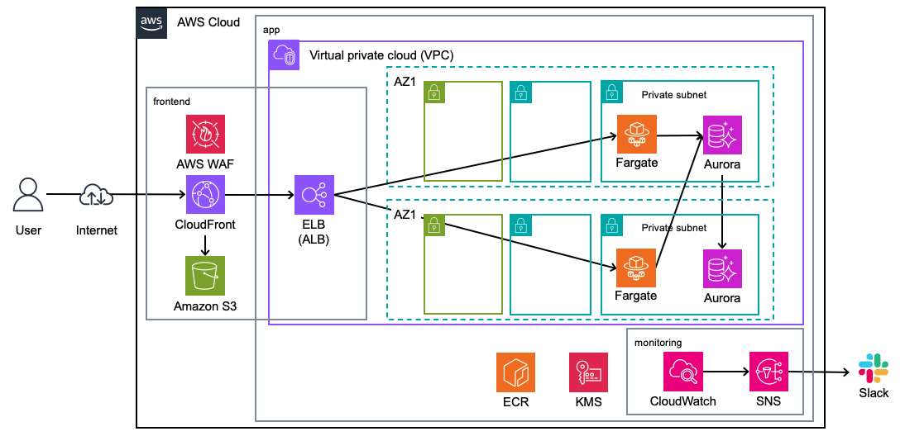
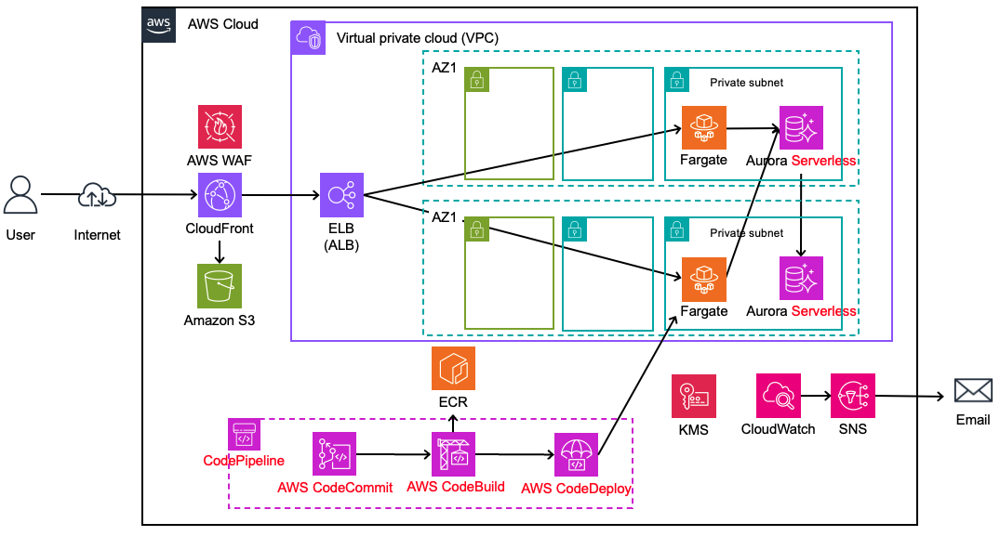

# Part 1
本パートでは以下の内容を取り扱います。
- ワークショップ環境の構築
- BLEA サンプルアプリケーションのデプロイ
- ワークショップ内容の説明

## 1. セットアップ
ワークショップの実行環境のために[こちら](https://catalog.workshops.aws/typescript-and-cdk-for-beginner/ja-JP/10-getting-started/20-cloud9)の手順に従って、Cloud9 のセットアップを行います。

- インスタンスタイプは m5.large
- タイムアウトは 4 時間

## 2. BLEA サンプルアプリのデプロイ
### 2.1 初回デプロイ
BLEA ECS サンプルアプリケーションをデプロイします。

コードの取得
```bash
git clone https://github.com/miya10/blea_ecs_sample.git
cd blea_ecs_sample
git checkout init
git pull
```

パッケージのインストール
```bash
npm ci
```

CDK の準備
```bash
npx cdk bootstrap
```

CDK 初回デプロイ（30 分前後かかります）
```bash
npx cdk deploy --all
```

Tips
> npx cdk deploy や destroy の時に Do you wish to deploy these changes (y/n)? などの確認がスキップする方法
> - コマンド実行時に --require-approval never オプションをつける
> - コマンド実行時に --force (-f) オプションをつける
> - cdk.json に "requireApproval": "never" を追加（プロジェクト全体に適用することが可能）

※ エラーが出る場合
- 原因：For CLOUDFRONT, you must create your WAFv2 resources in the US East (N. Virginia) Region, us-east-1 ([URL](https://docs.aws.amazon.com/ja_jp/AWSCloudFormation/latest/UserGuide/aws-resource-wafv2-webacl.html#aws-resource-wafv2-webacl-properties)).
- 対処法
  - us-east-1にも `npx cdk bootstrap` する必要がある
  - `npx cdk bootstrap aws://<account_id>/us-east-1` を実行

デプロイが完了すれば、CloudFront のディストリビューションドメインにアクセスしてください。以下のように「It works!」という画面が出ていれば、サンプルアプリケーションのデプロイは構築です。



### 2.2 サンプルアプリの解説
#### ディレクトリの構造
- `bin/blea-guest-ecs-app-sample.ts`：CDK アプリケーションのエントリポイントです。最初にこのファイルから実行されます。`lib/stack/` で定義されたスタックをロードします。
- `lib/`
  - `stack/`：CDK アプリケーションのスタック群が定義されます。
  - `construct/`：CDK アプリケーションのコンストラクト群が定義されます。
  - `stage/`：ステージング環境用の CDK アプリケーションが定義されます。
- `node_modules/`：npm によって管理され、プロジェクトのすべての依存関係が含まれます。
- `test/`：CDK アプリケーションをテスト・検証するために必要なファイルを格納するフォルダです。
- `.git/`：CDK アプリケーションを Git 管理するための情報を格納するフォルダです。cdk init コマンドではデフォルトで自動作成されます。
- `cdk.json`：アプリの実行方法をツールキットに指示させるためのファイルです。
- `package.json`：npm モジュールのマニフェストファイルです。これは、アプリの名前、バージョン、依存関係、“watch” や “build” 用のビルドスクリプトなど、さまざまな情報が含まれるファイルのことです。（package-lock.json は npm によって管理されます）
- `tsconfig.json`：プロジェクトの TypeScript 設定です。
- `.gitignore` と `.npmignore`：Git と npm 用のファイルです。ソースコードの管理に含める/除外するファイルと、パッケージマネージャーへの公開用設定が含まれています。


## 3. ワークショップの概要
#### BLEA で提供されている ECS のサンプルアプリケーション



#### サンプルをもとにデプロイしたアプリケーション
差分は以下の通り
- Email 通知の削除
- インフラストラクチャの CI/CD パイプラインの削除



#### 本ワークショップで構築する構成
- BLEA サンプルアプリケーションの修正（DB の修正）
- 自前のコンテナアプリケーションのデプロイ
- CI/CD パイプラインの構築

※ 赤字が本ワークショップの開発箇所

