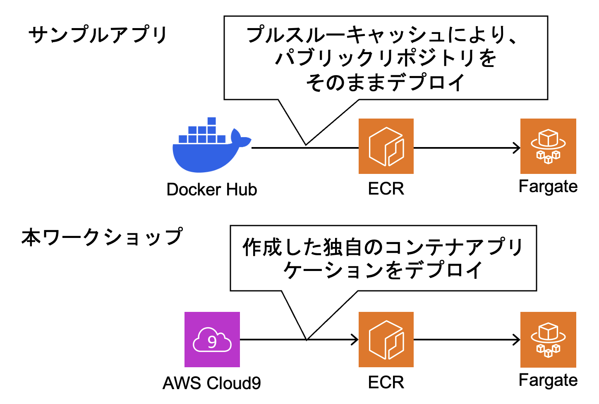
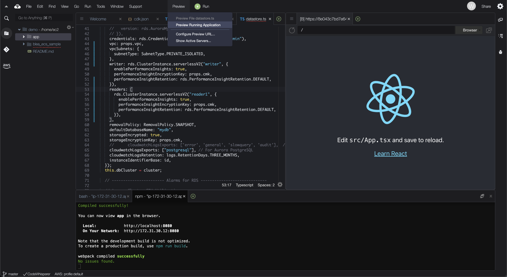
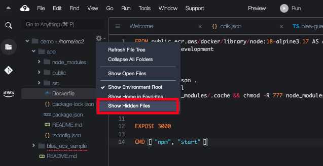
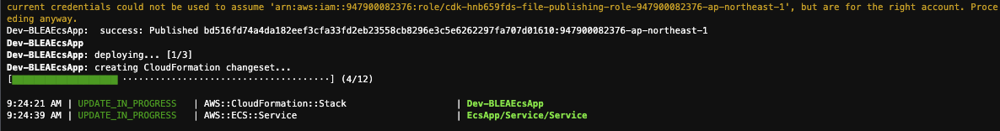
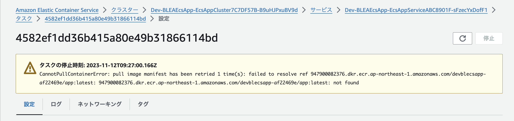
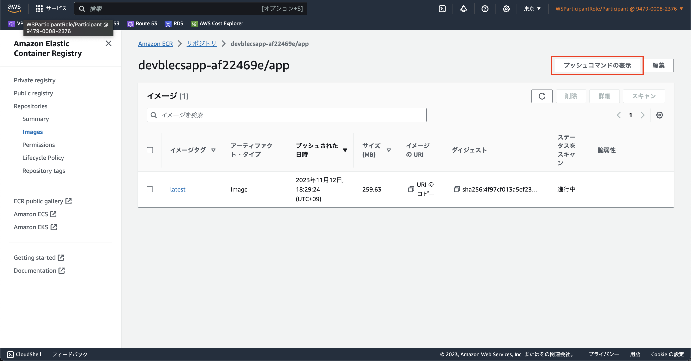
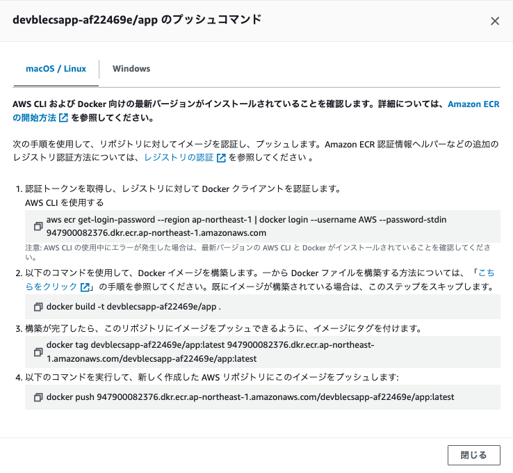
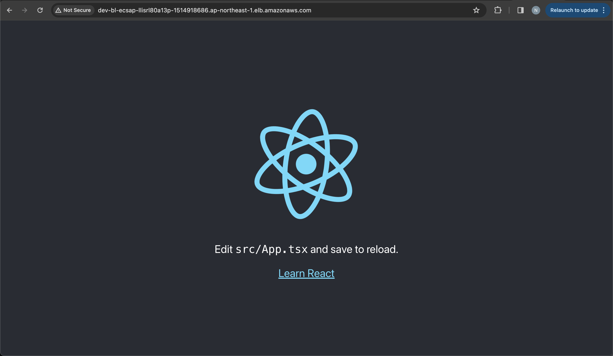

# Part 3
本パートでは以下の内容を取り扱います。
- アプリケーションの作成
- アプリケーションのコンテナ化
- ECR へのプッシュ



## 1. アプリケーションの作成
TypeScript でのアプリケーション開発では、`create-react-app` を使用して Web アプリケーションをセットアップします。

> `create-react-app` は単一ページの React アプリケーションを作成する方法として公式にサポートされています。設定不要の最新のビルドセットアップを提供します（[公式ドキュメント](https://create-react-app.dev/docs/getting-started/)）。

Typescript テンプレートを利用して、Web アプリケーションを作成します。
```bash
cd ~/environment
npx create-react-app app --template typescript
```

以下のようなディレクトリ構成が自動的に構築されます。
```
app
├── README.md
├── node_modules
├── package.json
├── .gitignore
├── public
│   ├── favicon.ico
│   ├── index.html
│   ├── logo192.png
│   ├── logo512.png
│   ├── manifest.json
│   └── robots.txt
└── src
    ├── App.css
    ├── App.js
    ├── App.test.js
    ├── index.css
    ├── index.js
    ├── logo.svg
    ├── serviceWorker.js
    └── setupTests.js
```

アプリケーションをローカルで実行してみます。
```bash
cd app
npm start
```

「Preview > Preview Running Application」からローカルで実行中のアプリケーションを確認します。

画像右側のようなアプリケーション画面が表示されると成功です。



ターミナルで実行中のアプリケーションを停止するには、`[CTRL]+C` を押します。

## 2. アプリケーションのコンテナ化
先ほどの手順で作成したアプリケーションを Docker を利用してコンテナ化します。

Dockerfile を作成して、アプリケーションをコンテナ化します。
> Docker は、Dockerfile からの指示を読み取ることで、イメージを自動的にビルドできます。Dockerfile は、イメージを作成するための全てのコマンドが含まれているテキストドキュメントです。docker build を使用すると、複数のコマンドライン命令を連続して実行する自動ビルドを作成できます。

> Cloud9 上でのファイル作成方法は、以下の通りです（フォルダも同様）。
> - コマンドを用いて作成：`touch <ファイル名>`
> - ファイルを作成したいフォルダを右クリック > New File

`Dockerfile` を `app` フォルダ内に作成し、以下のコードを貼り付けます。
```dockerfile
FROM public.ecr.aws/docker/library/node:18-alpine3.17 AS development
ENV NODE_ENV development

WORKDIR /app

COPY package.json .
RUN npm install
RUN mkdir node_modules/.cache && chmod -R 777 node_modules/.cache

COPY . .

EXPOSE 3000

CMD [ "npm", "start" ]
```

ビルドのパフォーマンスを向上させるために、.dockerignore ファイルを追加してファイルとディレクトリを除外します。

app フォルダのルートに .dockerignore ファイルを作成します。
```bash
cd ~/environment/app
touch .dockerignore
```

.dockerignore ファイルを開いて、以下の内容を貼り付けます。
```bash
**/node_modules
**/npm-debug.log
build
```

Tips
> ファイルエクスプローラーに .dockerignore ファイルが表示されない場合は、Cloud9 が「.」(ピリオドまたはフルストップ) で始まるファイルを非表示にしている可能性があります。変更するには、以下の操作を行います。
> 1. Cloud9 の File ナビゲーションペインから、Settings (右上隅の「歯車」) をクリックします。
> 2. Show Hidden Filesを選択します。
>
> 

Docker イメージをビルドします。
```bash
docker build -t app:latest .
```

ビルドしたイメージを確認します。
```bash
docker images
```

以下のように出力されると、問題なくイメージが作成されたことが確認できます。
```
REPOSITORY                           TAG             IMAGE ID       CREATED              SIZE
app                                  latest          f879615401a0   About a minute ago   899MB
public.ecr.aws/docker/library/node   18-alpine3.17   c2a82e9c8837   3 weeks ago          177MB
```

作成したイメージを開発環境で実行します。
```bash
docker run \
  -it \
  --rm \
  -v ${PWD}:/app \
  -v /app/node_modules \
  -p 8080:3000 \
  -e CHOKIDAR_USEPOLLING=true \
  app:latest
```
オプションの意味は以下の通りです。
- -it - コンテナをインタラクティブモードで実行するので、実行中のコンテナ内でコマンドを実行できます
- --rm - コンテナが削除される時に、コンテナに関連付けされた匿名ボリュームを削除します
- -v - 指定した場所にボリュームをマウントします
- -p - 単一のポートまたはポート範囲を明示的にマップします
- -e - 環境変数を設定します
- CHOKIDAR_USEPOLLING=true - ポーリングを使って、ファイルの変更を監視します

「Preview > Preview Running Application」からローカルで実行中のアプリケーションを確認します。
アプリケーションに問題なくアクセスできることが確認できれば、`[Ctrl]+C` でコンテナを停止します。

## 3. コンテナアプリケーションのデプロイ
このセクションでは ECR のリポジトリを作成し直し、コンテナアプリケーションをアップロードします。`lib/construct/ecsapp.ts` を編集していきます。

### 3.1 ECR を定義
まずは、現在の ECR の構成を見ていきましょう（233 行目〜）。
```typescript
// Container Registry
// - Using pull through cache rules
//   https://docs.aws.amazon.com/AmazonECR/latest/userguide/pull-through-cache.html
//   ecrRepositoryPrefix must start with a letter and can only contain lowercase letters, numbers, hyphens, and underscores and max length is 20.
const ecrRepositoryPrefix = Names.uniqueResourceName(this, {
  maxLength: 20,
  separator: "-",
}).toLowerCase();
new ecr.CfnPullThroughCacheRule(this, "PullThroughCacheRule", {
  ecrRepositoryPrefix: ecrRepositoryPrefix,
  upstreamRegistryUrl: "public.ecr.aws",
});

// Container
const containerImage = "docker/library/httpd";
const containerRepository = ecr.Repository.fromRepositoryName(
  this,
  "PullThrough",
  `${ecrRepositoryPrefix}/${containerImage}`
);

// The repository is automatically created by pull through cache, but you must specify it explicitly to enable ImageScanonPush.
new ecr.Repository(this, "Repository", {
  repositoryName: containerRepository.repositoryName,
  imageScanOnPush: true,
});
```

コードを見ると、プルスルーキャッシュルールが使用されています（[プルスルーキャッシュとは](https://zenn.dev/yoshii0110/articles/78591c40eeb775)）。
今回は独自のコンテナアプリケーションをデプロイしたいので、ECR の定義を書き換えていきます。

まずは、プルスルーキャッシュに関する以下のコードを削除していきます（`ecrRepositoryPrefix` などは再利用します）。
```typescript
new ecr.CfnPullThroughCacheRule(this, "PullThroughCacheRule", {
  ecrRepositoryPrefix: ecrRepositoryPrefix,
  upstreamRegistryUrl: "public.ecr.aws",
});
```
```typescript
const containerRepository = ecr.Repository.fromRepositoryName(
  this,
  "PullThrough",
  `${ecrRepositoryPrefix}/${containerImage}`
);
```

`containerImage` を書き換えます。
```typescript
const containerImage = "app"
```

リポジトリの定義を修正します。
```typescript
this.repository = new ecr.Repository(this, "Repository", {
  repositoryName: `${ecrRepositoryPrefix}/${containerImage}`,
  imageScanOnPush: true,
});
```

`repository` を外部（CI/CD パートで活用します）から参照可能なように、以下の定義をファイル冒頭（32行目） `export class EcsApp extends Construct {` の後ろに追加します。
```typescript
public readonly repository: ecr.Repository;
```
> TypeScript のクラス構文について（[参照](https://zenn.dev/kimura141899/articles/60bd0bc399296c)）

以上で、ECR の定義は完了です。

### 3.2 ECS を修正
ECR の変更を ECS の CDK 定義に加えるとともに、いくつかパラメータを修正します。

#### image 引数の修正
まずは、現在の ECS の定義を見てみましょう。
```typescript
const ecsContainer = taskDefinition.addContainer("App", {
  // -- Option 1: If you want to use your ECR repository with pull through cache, you can use like this.

  image: ecs.ContainerImage.fromEcrRepository(
    containerRepository,
    "latest"
  ),
  ...
```

引数内の指定リポジトリを先ほど定義した ECR のリポジトリに変更します。
```typescript
image: ecs.ContainerImage.fromEcrRepository(
  this.repository,
  "latest"
),
```

#### service を参照可能な形式に変更
続いて、ECR と同様に `service` を外部（CI/CD パートで活用します）から参照可能なように、以下の定義をファイル冒頭（32行目） `export class EcsApp extends Construct {` の後ろに追加します。
```typescript
public readonly service: ecs.FargateService;
```

併せて、`service` 変数が利用されているすべての箇所（合計 5 箇所）を `this.service` に置き換えます。

これまで定義した `repository`, `service` を `stack/blea-guest-ecs-app-sample-stack.ts` から参照します。
ファイルを開き、以下のコードを追加します。

```typescript
import { aws_ecr as ecr, aws_ecs as ecs } from "aws-cdk-lib";
```
```typescript
public readonly repository: ecr.Repository;
public readonly service: ecs.FargateService;
```
```typescript
this.repository = ecsapp.repository;
this.service = ecsapp.service;
```

#### パラメータの修正
タスク定義、ポート番号、ヘルスチェックの猶予期間のパラメータを修正します。

まずはタスク定義から修正していきます。以下のように定義されているメモリ制限を 512 MiB から 2048 MiB に書き換えてください。

```typescript
// Task definition
// https://docs.aws.amazon.com/AmazonECS/latest/developerguide/task_definition_parameters.html
const taskDefinition = new ecs.FargateTaskDefinition(
  this,
  "TaskDefinition",
  {
    executionRole: taskExecutionRole,
    taskRole: taskRole,
    cpu: 256,
    memoryLimitMiB: 512,
  }
);
```

以下のように修正します。これにより、TypeScript のアプリケーションがメモリ不足で起動しない問題を防ぎます。
```typescript
memoryLimitMiB: 2048,
```

続いて、以下のコンテナのポート設定を書き換えます。
```typescript
ecsContainer.addPortMappings({
  containerPort: 80,
});
```

作成した TypeScript アプリケーションはデフォルトでポート 3000 番で起動するので、ポート番号を上書きします。
```typescript
containerPort: 3000,
```

最後に、ヘルスチェックの猶予期間を修正します。こちらは新しいコンテナの立ち上げ時に、ヘルスチェックが行われるまでデフォルトでは 60 秒の猶予期間が設けられています。しかし、本ワークショップで作成したアプリケーションの立ち上げは 60 秒以上かかることから、猶予期間（`healthCheckGracePeriodSeconds` パラメータ）を 600 秒に変更します。

> `healthCheckGracePeriodSeconds`（[公式ドキュメント](https://docs.aws.amazon.com/ja_jp/AmazonECS/latest/developerguide/service_definition_parameters.html)）
> 
> Amazon ECS サービススケジューラが、タスクが RUNNING 状態になった後で異常な Elastic Load Balancing ターゲットのヘルスチェック、コンテナのヘルスチェック、Route 53 のヘルスチェックを無視する期間 (秒単位)。

ただし、`healthCheckGracePeriodSeconds` パラメータは L2 コンストラクトでは対応していないので、L1 レベルで定義を行う必要があります。

L1 コンストラクト <-> L2 コンストラクトのリソースの記述については、[公式ドキュメント](https://docs.aws.amazon.com/ja_jp/cdk/v2/guide/cfn_layer.html)を参考してください。

本ワークショップでは、`addPropertyOverride` メソッドにより構成を L1 レベルで上書きします。
以下のコードを `// Define ALB Target Group` の真上に挿入してください。
```typescript
const cfnService = this.service.node.defaultChild as ecs.CfnService;
cfnService.addPropertyOverride('healthCheckGracePeriodSeconds', '600');
```

#### デプロイ
修正を加えた CDK の構成をデプロイします。
```bash
npx cdk diff
npx cdk deploy Dev-BLEAEcsApp
```

しかしエラーも出ずに、進捗が停止します。



コンソール上で作成された ECS のタスクを見ると、以下のように ECR リポジトリからイメージを pull できないことでエラーが出ているようです。



新しく定義した ECR リポジトリにイメージがないという内容のエラーが出ています。
[ECR](https://ap-northeast-1.console.aws.amazon.com/ecr/get-started?region=ap-northeast-1) を確認すると、確かにイメージがないことがわかります。

そのため、先ほどビルドしたイメージを手動でプッシュします。AWS のマネジメントコンソール上で CDK により作成されたリポジトリ（`devblecsapp-xxxxxxxx/app`）を選択して、プッシュコマンドの表示をクリックします。



イメージを ECR に push するためのコマンドが表示されるので、上から順にコピーして実行します。

なお、2 つ目のコマンドはコンテナをビルドするためのものであり、すでに実行済みですのでスキップしても大丈夫です。スキップする場合、3 つめのコマンドのタグ名は `app:latest` に変更する必要があります。



※ もし新しくイメージをビルドした際に `no space left on device` というエラーが出た場合は、以前に作成したコンテナとイメージを削除してデバイスの空き容量を確保してください（[参考](https://zenn.dev/ryuu/scraps/a1efb79aaa1bb2)）。

しばらく待てば問題なくデプロイが完了します。

最後に、正常にアプリケーションにアクセスできることを確認します。マネジメントコンソール上で[ロードバランサー](https://ap-northeast-1.console.aws.amazon.com/ec2/home?region=ap-northeast-1#LoadBalancers:)から、作成された ELB の DNS 名をコピーしてブラウザで閲覧します。


