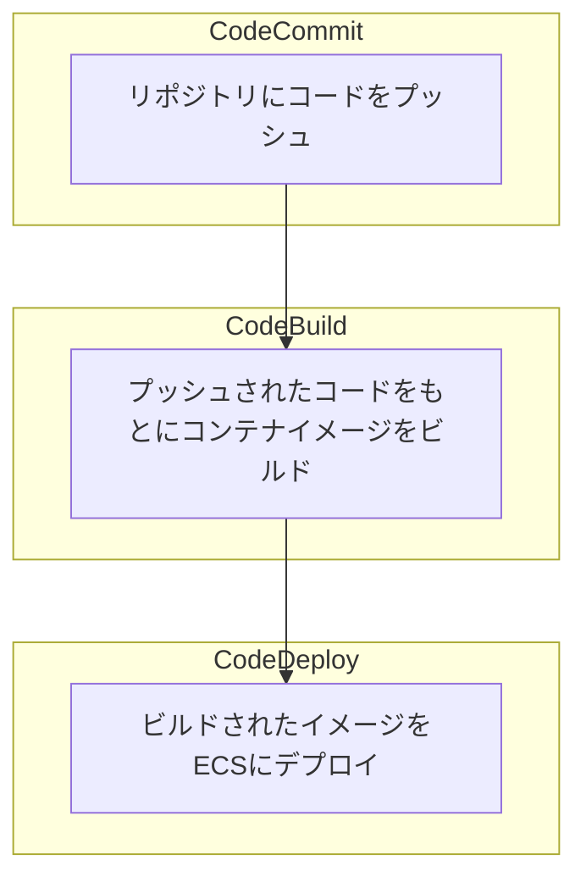
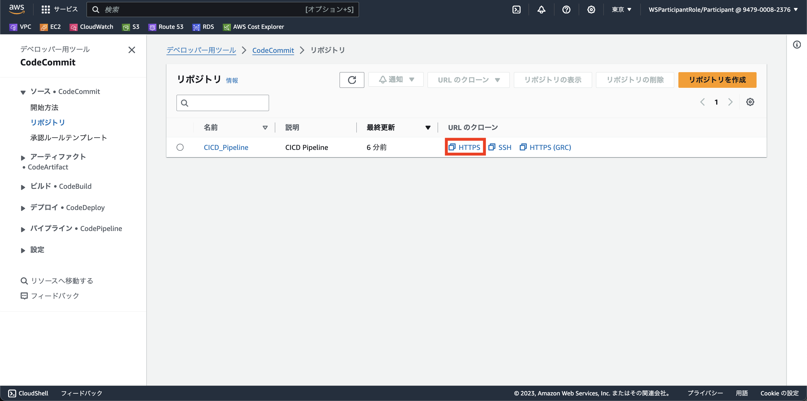
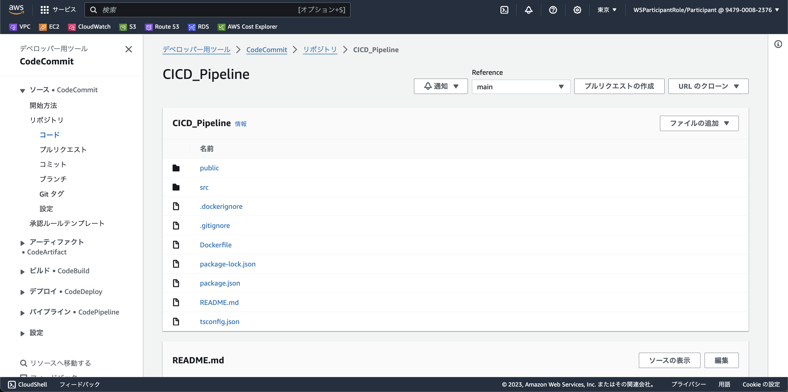
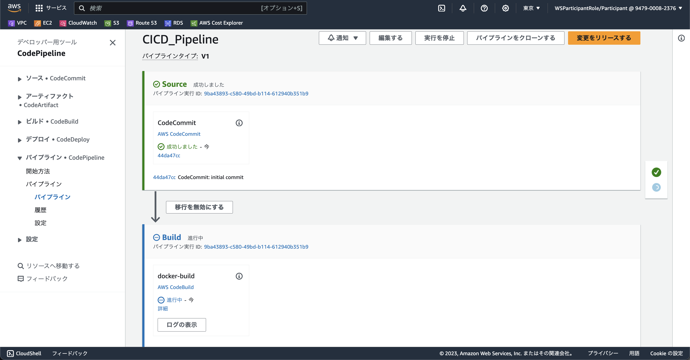
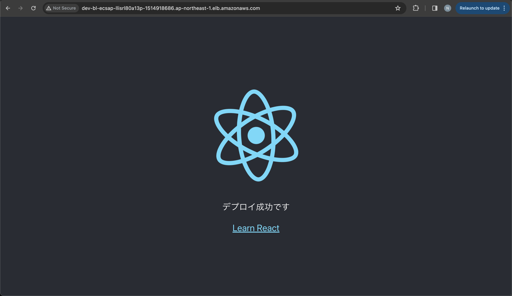

# Part 4
本パートでは以下の内容を取り扱います。
- CI/CD の導入（AWS CodePipeline）
  - ソース管理（AWS CodeCommit）
  - コードのビルド（AWS CodeBuild）
  - コードのデプロイ（AWS CodeDeploy）



## 1. ソース管理（AWS CodeCommit）
### 1.1 ローカル Git リポジトリの作成
このセクションでは、Git を設定し、ソースコード用のローカル Git リポジトリをセットアップします。

#### ローカルの Git リポジトリを削除する
デフォルトでは、先ほどのステップで作成したテンプレートのサプリケーションはローカルの Git リポジトリも初期化します。しかし、これから自分で管理することになるので、Git 参照を削除しましょう。

`.git` フォルダごと削除します。
```bash
cd ~/environment/my-app
rm -rf .git
```

#### Git のグローバル設定を行う
使用するデフォルトブランチや、コミットに使用する名前やメールアドレスなど、リポジトリのデフォルト設定をいくつか設定します。これは、`git config` コマンドを使用して行います。

デフォルトブランチを `main` に設定します。
```bash
git config --global init.defaultBranch main
```

--- これより以下のステップはスキップ可能 ---

`git config` を実行して、your-user-name と your-email-address のプレースホルダーで表されるユーザー名とメールアドレスをローカルリポジトリに追加します。これにより、行ったコミットを簡単に識別できます。
```bash
git config --global user.name "your-user-name"
git config --global user.email your-email-address
```

`--list` フラグを使用して、デフォルトブランチ、名前、メールアドレスが正しく設定されていることを確認します。
```bash
git config --list
```

以下の出力が、含まれているはずです。
```
init.defaultbranch=main
user.name=your-user-name
user.email=your-email-address
```

#### ローカルリポジトリを初期化する
次に、ローカル Git リポジトリを作成します。

作業ディレクトリのルートから、`git init` コマンドでソース管理リポジトリを初期化します。
```bash
git init
```

`git init` は空の Git リポジトリを作成するか、既存のリポジトリを再初期化します。
作業ディレクトリのステータスを調べてみましょう。
```bash
git status
```

私たちがいるのはメインブランチで、コミットはありませんが、アプリケーションは「Untracked files」の下にリストされていることが分かります。
```
On branch main

No commits yet

Untracked files:
  (use "git add <file>..." to include in what will be committed)
        app/

nothing added to commit but untracked files present (use "git add" to track)
```

これで、Git ローカルリポジトリのセットアップは完了です。

### 1.2 CI/CD パイプラインスタックの作成
全ての CICD パイプラインインフラストラクチャを、`lib/pipeline-cdk-stack.ts` というスタックで定義します。

`pipeline-cdk-stack.ts` という名前でファイルを作成し、`PipelineCdkStack` を定義します。

```typescript
import { Stack, StackProps } from 'aws-cdk-lib';
import { Construct } from 'constructs';

export class PipelineCdkStack extends Stack {
  constructor(scope: Construct, id: string, props: StackProps) {
    super(scope, id, props);


  }
}
```

`PipelineCdkStack` では、後ほど `Dev-BLEAEcsApp` で定義された `repository`（ECR リポジトリ）, `service`（ECS のサービス） を参照します（[CDK でほかのスタックにあるリソースを参照したい](https://zenn.dev/5hintaro/articles/e8a20c171bf8fd)）。

`bin/blea-guest-ecs-app-sample.ts` に `Dev-BLEAEcsApp` のリソース（`repository`, `service`）を渡します。
```typescript
import { PipelineCdkStack } from "../lib/stack/pipeline-cdk-stack";

...

new PipelineCdkStack(app, "CICDPipeline", {
  env: {
    account: devParameter.env?.account || process.env.CDK_DEFAULT_ACCOUNT,
    region: devParameter.env?.region || process.env.CDK_DEFAULT_REGION,
  },
  crossRegionReferences: true,
  tags: {
    Repository: "sample-container-app",
    Environment: devParameter.envName,
  },
  ecrRepository: ecsapp.repository,
  fargateService: ecsapp.service
});
```

次に、別スタックのリソースを参照します（`pipeline-cdk-stack.ts`）。
```typescript
import * as ecs from "aws-cdk-lib/aws-ecs";
import * as ecr from "aws-cdk-lib/aws-ecr";
```
```typescript
interface ConsumerProps extends StackProps {
  ecrRepository: ecr.Repository;
  fargateService: ecs.FargateService;
}
```

既存の `StackProps` を
```typescript
constructor(scope: Construct, id: string, props: StacksProps) {
```

今定義した `ConsumerProps` 書き換えます。
```typescript
constructor(scope: Construct, id: string, props: ConsumerProps) {
```

これで、ECR リポジトリと ECS サービスを `PipelineCdkStack` 内で参照することができます。
以降では `PipelineCdkStack` にコードを記述していきます。

### 1.3 AWS CodeCommit リポジトリの作成
[CDK API Reference](https://docs.aws.amazon.com/cdk/api/v2/docs/aws-cdk-lib.aws_codecommit.Repository.html) を参照して、スタック内に CodeCommit リポジトリを定義していきます。

CodeCommit パッケージをインストールします。
```typescript
import * as codecommit from 'aws-cdk-lib/aws-codecommit';
```

`codecommit` コンストラクトを使用して、`CICD_Repository` という新しい CodeCommit リポジトリを作成します。
```typescript
const sourceRepo = new codecommit.Repository(this, "CICD_Repository", {
  repositoryName: "CICD_Repository",
  description: "CICD Repository",
});
```

ステージは、パイプラインの作成時に選択した Amazon S3 アーティファクトバケットに保存されている入力アーティファクトと出力アーティファクトを使用します。 CodePipeline ステージのアクションタイプに応じて、入力または出力アーティファクトのファイルを zip して転送します。

入力および出力アーティファクトの詳細については、[こちら](https://docs.aws.amazon.com/codepipeline/latest/userguide/welcome-introducing-artifacts.html)をご覧ください。

codepipeline コンストラクトをインポートします。
```typescript
import * as codepipeline from 'aws-cdk-lib/aws-codepipeline';
```

ソースとユニットテストのステージにアーティファクトを追加します。
```typescript
const sourceOutput = new codepipeline.Artifact();
```

Tips
> Cloud9 IDE 上でコードのフォーマット整形を行いたい場合は、Edit > Code Formatting から設定を変更できます。

追加内容をデプロイします。
```bash
npx cdk diff
npx cdk deploy CICDPipeline
```

[CodeCommit](https://ap-northeast-1.console.aws.amazon.com/codesuite/codecommit/repositories?region=ap-northeast-1#) を確認します。
後ほど利用するので、URL のクローンより HTTPS の URL をコピーしておきます。



ローカルリポジトリをリモートリポジトリに接続します。
```bash
cd ~/environment/app
git remote add origin <コピーした URL>
```

オリジンが設定されていることを確認します。
```bash
git remote -v
```

フェッチ (fetch) とプッシュ (push) のオリジンが、ターミナルに一覧表示されるはずです。
```
origin  https://git-codecommit.eu-west-2.amazonaws.com/v1/repos/CICD_Workshop (fetch)
origin  https://git-codecommit.eu-west-2.amazonaws.com/v1/repos/CICD_Workshop (push)
```

`app/` フォルダの中身をリポジトリにプッシュします。
Commit を main ブランチにします（CodeCommit のデフォルトが main のため）。
```bash
git add .
git commit -m "initial commit"
git push --set-upstream origin main
```

マネジメントコンソールで、CodeCommit の中身を見てみましょう。



### 1.4 ビルドパイプラインの作成
コード変更がメインブランチにプッシュされるたびに、自動的にコードビルドを実行するようにパイプラインを構築します。

#### パイプラインの定義
前のセクションで作成した `pipeline-cdk-stack.ts` を拡張して、パイプラインを定義し、すでに定義して設定しているソース管理リポジトリを参照するようにします。

CICD_Pipeline という新しい codepipeline を作成します。
```typescript
const pipeline = new codepipeline.Pipeline(this, 'CICD_Pipeline', {
  pipelineName: 'CICD_Pipeline',
  crossAccountKeys: false,
});
```

ソース管理リポジトリにステージとアクションを追加します。
```typescript
import * as codepipeline_actions from "aws-cdk-lib/aws-codepipeline-actions";

...

pipeline.addStage({
  stageName: 'Source',
    actions: [
      new codepipeline_actions.CodeCommitSourceAction({
        actionName: 'CodeCommit',
        repository: sourceRepo,
        output: sourceOutput,
        branch: "main",
      }),
    ],
});
```

#### イメージのビルド仕様の作成
ビルド仕様ファイルに、ライブラリのインストール、コンテナイメージのビルド、Amazon ECR へのアップロードに必要なアクションを定義します。

`app/` フォルダに `buildspec_docker.yml` という名前の新しいファイルを作成します。

以下をコピーして、コンテナをビルドするビルド仕様を定義します。
```yml
version: 0.2

phases:
  install:
    runtime-versions:
      nodejs: 14
  pre_build:
    commands:
      - echo Logging in to Amazon ECR...
      - aws ecr get-login-password --region $AWS_DEFAULT_REGION | docker login --username AWS --password-stdin $AWS_ACCOUNT_ID.dkr.ecr.$AWS_DEFAULT_REGION.amazonaws.com
  build:
    commands:
      - echo Build started on `date`
      - echo Building the Docker image...
      - docker build -t app:$IMAGE_TAG .
      - docker tag app:$IMAGE_TAG $IMAGE_REPO_URI:$IMAGE_TAG
  post_build:
    commands:
      - echo Build completed on `date`
      - echo Pushing the Docker image...
      - docker push $IMAGE_REPO_URI:$IMAGE_TAG
      - echo Writing image definitions file...
      - printf '[{"name":"App","imageUri":"%s"}]' $IMAGE_REPO_URI:$IMAGE_TAG > $CODEBUILD_SRC_DIR/imagedefinitions.json

artifacts:
    files: imagedefinitions.json
```

このビルド仕様は、次のことを行います。
- Amazon ECR へのログイン。
- イメージのビルド (docker build)。
- イメージのタグ付け (docker tag)。
- イメージを Amazon ECR にプッシュ (docker push)。

以下の環境変数が、必要であることに注意してください（後ほど定義）。
- AWS_DEFAULT_REGION : リージョン ID の値。
- IMAGE_TAG : ビルドに使用するタグ。
- IMAGE_REPO_URI : Amazon ECR respository URI の値。

Tips
> ビルド環境の環境変数
> 
> AWS CodeBuild には、ビルドコマンドで使用できる、いくつかの環境変数が用意されています。 CodeBuild の環境変数の詳細については、[こちら](https://docs.aws.amazon.com/codebuild/latest/userguide/build-env-ref-env-vars.html)をご覧ください。

最後に `buildspec_docker.yml` をリポジトリに反映させるために、`app/` フォルダの中身をリポジトリにプッシュします。
Commit を main ブランチにします（CodeCommit のデフォルトが main のため）。
```bash
git add .
git commit -m "initial commit"
git push --set-upstream origin main
```

#### パイプライン上でビルドを定義
パイプラインには、ビルド用の環境を提供する PipelineProject を新しく定義し、上記のビルド仕様ファイルを参照する必要があります。


codebuild コンストラクトをインポートします。
```typescript
import * as codebuild from 'aws-cdk-lib/aws-codebuild';
```

Docker ビルドステージに、新しく PipelineProject を追加します。
```typescript
const dockerBuildProject = new codebuild.PipelineProject(
  this,
  "DockerBuildProject",
  {
    environmentVariables: {
      IMAGE_TAG: { value: "latest" },
      IMAGE_REPO_URI: { value: props.ecrRepository.repositoryUri },
      AWS_ACCOUNT_ID: { value: process.env.CDK_DEFAULT_ACCOUNT },
      AWS_DEFAULT_REGION: { value: props.env?.region },
    },
    environment: {
      buildImage: codebuild.LinuxBuildImage.STANDARD_5_0,
      privileged: true,
      computeType: codebuild.ComputeType.LARGE,
    },
    buildSpec: codebuild.BuildSpec.fromSourceFilename(
      "buildspec_docker.yml"
    ),
  }
);
```

ビルド環境には Amazon ECR にプッシュする権限がないため、これを許可するポリシーを作成します。

IAM コンストラクトをインポートします。
```typescript
import * as iam from 'aws-cdk-lib/aws-iam';
```

CodeBuild プロジェクトに IAM ポリシーステートメントを追加して、ビルド環境が Amazon ECR とやりとりできるようにします。
```typescript
const dockerBuildRolePolicy =  new iam.PolicyStatement({
  effect: iam.Effect.ALLOW,
  resources: ['*'],
  actions: [
    'ecr:GetAuthorizationToken',
    'ecr:BatchCheckLayerAvailability',
    'ecr:GetDownloadUrlForLayer',
    'ecr:GetRepositoryPolicy',
    'ecr:DescribeRepositories',
    'ecr:ListImages',
    'ecr:DescribeImages',
    'ecr:BatchGetImage',
    'ecr:InitiateLayerUpload',
    'ecr:UploadLayerPart',
    'ecr:CompleteLayerUpload',
    'ecr:PutImage'
  ]
});
```

ロールをビルドプロジェクトに追加します。
```typescript
dockerBuildProject.addToRolePolicy(dockerBuildRolePolicy);
```

Docker ビルドの出力アーティファクトを追加します。
```typescript
const dockerBuildOutput = new codepipeline.Artifact();
```

最後に、コンテナをビルドするステージを追加します。
```typescript
pipeline.addStage({
  stageName: 'Build',
  actions: [
    new codepipeline_actions.CodeBuildAction({
      actionName: 'docker-build',
      project: dockerBuildProject,
      input: sourceOutput,
      outputs: [dockerBuildOutput],
    }),
  ],
});
```

パイプラインをデプロイします。
```bash
npx cdk diff
npx cdk deploy CICDPipeline
```

[CodePipeline](https://ap-northeast-1.console.aws.amazon.com/codesuite/codepipeline/pipelines?region=ap-northeast-1) が正常に作成されていることを確認します。



#### 継続的デプロイ
本番環境（ECS）へのデプロイプロセスを追加します。

以下のステージを追加してましょう。
```typescript
pipeline.addStage({
  stageName: 'Deploy',
  actions: [
    new codepipeline_actions.EcsDeployAction({
      actionName: 'deployECS',
      service: props.fargateService,
      input: dockerBuildOutput
    }),
  ]
});
```

パイプラインをデプロイします。
```bash
npx cdk diff
npx cdk deploy CICDPipeline
```

最後に、アプリケーションに変更を加えて、デプロイまで自動に走るか確認します。

アプリケーションの `app/src/App.tsx` の任意の箇所を修正します。
```typescript
import React from 'react';
import logo from './logo.svg';
import './App.css';

function App() {
  return (
    <div className="App">
      <header className="App-header">
        
        <p>
          Edited
        </p>
        <a
          className="App-link"
          href="https://reactjs.org"
          target="_blank"
          rel="noopener noreferrer"
        >
          Learn React
        </a>
      </header>
    </div>
  );
}

export default App;
```

その後、`app/` フォルダの中身をリポジトリにプッシュします。
```bash
git add .
git commit -m "initial commit"
git push --set-upstream origin main
```

5〜10 分後に確認すると、正常にデプロイができていることが確認できます。




お疲れ様でした。こちらで本ワークショップは終了です。

CI/CDにおけるテスト環境の構築やより詳細な実装を学びたい方は、[CI/CD on AWS ワークショップ
](https://catalog.us-east-1.prod.workshops.aws/workshops/40f6bef0-35e1-4aeb-8359-1584d37d916b/ja-JP) がおすすめです。